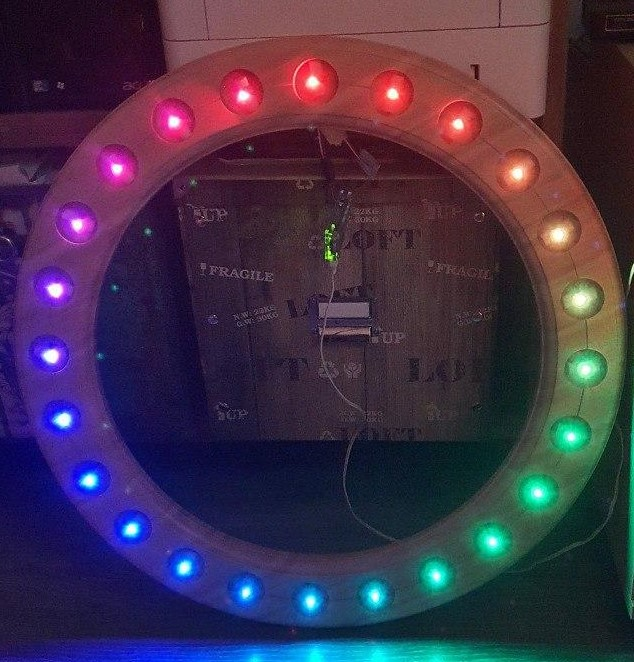

### Many thanks for inspiring me to 
 * **Nazmus Nasir** https://www.easyprogramming.net, https://github.com/naztronaut
 * **John Simmons** https://github.com/johndavidsimmons
 * **Felix Stern** https://tutorials-raspberrypi.de
---

# LedPiBot 
     [](https://unlicense.org/)<br>
With this bot it is possible to control 24 artificial candles, in this case a wooden wreath is used and animated. 

Refer [Hardware description](./hardware/HARDWARE.md) and see some [impressions](hardware/media).
 

### Apart from default packages following is required additionally
* gcc , make, build-essential, python-dev, git, scons, swig
* from https://github.com/jgarff/rpi_ws281x clone, compile/build/install neopixel package 
* telepot as Python framework, https://telepot.readthedocs.io/en/latest/reference.html
* logrotate

### Enable [run at bootup](https://www.dexterindustries.com/howto/run-a-program-on-your-raspberry-pi-at-startup/#local)
````bash
# Edit rc.local 
sudo nano /etc/rc.local
# Insert 
sudo python3 /home/pi/bot.py &
````


[](https://unlicense.org/)<br>
[LICENSE](https://github.com/kaulketh/ledpibot/blob/master/LICENSE) / [UNLICENSE](https://github.com/kaulketh/ledpibot/blob/master/UNLICENSE)